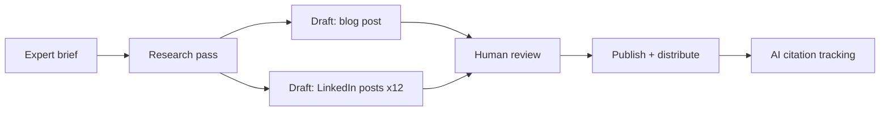

# How We Turned One Expert Brief Into 12 LinkedIn Posts, 1 Blog, and 3 AI Citations

**Meta description:** We turned one expert brief into 12 LinkedIn posts, 1 blog, and 3 AI citations. Here's the exact workflow, output count, and proof — not just a claim.  
**URL slug:** /one-expert-brief-to-12-linkedin-posts-1-blog-3-ai-citations  
**Word count:** ~1600  
**Primary keyword:** AI content workflow

* * *

We're publishing this piece with a gap in it on purpose. The count in the title is real: one expert brief became 12 LinkedIn posts, 1 blog post, and 3 AI citations. What we can't do yet is show you every artifact behind that count. Some of the source material is still being pulled from internal exports. Where that's true, we've marked it plainly instead of filling the space with a plausible-sounding stand-in.

## The brief we started with

Every derivative asset in this piece traces back to one input: a written expert brief, not a transcript, not a set of scattered notes stitched together after the fact. That distinction matters because it's the difference between "content workflow" as a category claim and a workflow as something you can point to and count.

We picked this particular brief as the example because it ran the full path end to end, from initial expert input through review to published, citeable output, without a stalled stage in the middle. That completeness is rare enough to be worth documenting on its own.

"Expert-led" gets used loosely in this category. Here it means something specific: a subject-matter expert supplied the raw judgment and claims, and every downstream asset (the LinkedIn posts, the blog post) had to trace back to something that expert actually said, not a generic paraphrase of the topic. The brief is the anchor. If a post drifted from it, it got rewritten or cut.

\[NEEDS EXPERT INPUT: What were the exact review checkpoints, approvals, or handoff rules in this run, and how many people touched the brief before the assets were published?\]

## The workflow stages that turned it into 16 assets

We've written before about [the eight-stage workflow this ran through](https://www.boki.io/blog), and we're not re-explaining it here. If you want the general framework, that post covers it. This section is about what actually happened with this specific brief.

The brief moved through research, drafting, review, and distribution stages, with a human checkpoint sitting between draft and publish at each stage rather than at the end of the whole run. That sequencing is the operational detail that a stage-by-stage explainer can't show you: not that review exists, but where it sits and how often it fires.

Exact elapsed time and the number of edit rounds this run took are not available in this pack yet. We're not filling that with an estimate.

**Visual needed:** Screenshot of workspace stages showing this brief moving through the pipeline.  
*(Editor's note: internal export required before this can ship.)*

## The output inventory: 12 LinkedIn posts, 1 blog, 3 AI citations

Here's the count, broken out by asset type.

| Asset type | Count | Status |
| --- | --- | --- |
| LinkedIn posts | 12 | [NEEDS EXPERT INPUT: Can you provide the full 16-asset inventory with the real LinkedIn post angles or titles and the one blog post URL/title, so the count is backed by named examples rather than just a total?] |
| Blog post | 1 | Same as above — title/URL pending |
| AI citations | 3 | See Proof section below |
| Total derivative assets | 16 |  |

The number itself is the point of this section, and we're not going to dress it up with invented post titles or a manufactured excerpt while the real ones are still pending export. A total without named examples is a weaker claim than a total with them, and we'd rather say that plainly than paper over it.

**Visual needed:** Asset tree showing all 16 derivative outputs mapped from the source brief.  
*(Editor's note: requires the actual 12 LinkedIn post outputs and the blog post; blocked pending internal export.)*

## Proof: the AI citations themselves

This is the section that matters most, and it's also the one we can say the least about right now.

Three AI citations came out of this run. What we don't yet have confirmed and dated in this pack is which surface cited the content (ChatGPT, Perplexity, Gemini, or Google AI Overviews), whether each instance was a direct mention or a source inclusion in a longer answer, and the date each citation was captured. Those three details are what separate "we got cited" from a verifiable claim a reader can check.

\[NEEDS EXPERT INPUT: Which exact AI surfaces cited the content, on what dates, and was each one a direct mention or a source inclusion?\]

**Visual needed:** Citation screenshots with source, surface, and date, for each of the 3 citations.  
*(Editor's note: this is the single most load-bearing proof asset in the piece. Do not publish without it, or narrow the claim to "3 AI citations, screenshots forthcoming" if a deadline forces publication first.)*

## Why this wasn't a custom script we duct-taped together

The honest alternative here isn't a competing platform. It's a team member with an automation tool and a weekend. Seer Interactive published a detailed account of building an SME-to-content pipeline on n8n, phone-calling subject matter experts and feeding the transcripts into an automated drafting system. Their team member "built V1 in 3 weeks" ([Seer Interactive](https://www.seerinteractive.com/insights/use-ai-to-call-your-smes-and-create-content-with-substance-not-slop)). That's a real, credible, low-cost way to get from expert input to published content, and three weeks for a working version is fast.

We don't have a first-party number that beats that on time or cost, so we're not claiming one. What we can say is structural, not competitive: a single-operator script depends on one person maintaining it, debugging it when an API changes, and remembering the review steps that live in that person's head rather than in the workflow itself. The run behind this piece had defined review checkpoints between draft and publish at each stage, which means the process doesn't stop if the person who built it takes a week off.

That's a difference in where the coordination lives, not a claim that one approach produces content faster than the other. **blocked:** any time-saved, cost, or throughput comparison between this workflow and a custom n8n build, pending first-party timing data.

If your team has one technical person who can keep a custom pipeline running indefinitely, that's a reasonable answer. If your team needs the same output across multiple contributors, without the process breaking when one person is unavailable, that's a different requirement, and it points toward a workflow with the review stages built in rather than remembered.

## What we'd do differently

Three things are worth carrying into your next expert brief, regardless of what tooling you use:

-   **Anchor every derivative asset back to the brief, not the topic.** The check we ran on this piece was simple: does this LinkedIn post trace to something the expert actually said, or does it just cover the same subject in generic terms. The second one gets cut.
    
-   **Put review checkpoints between stages, not at the end.** Catching drift after 12 posts are drafted is expensive. Catching it after the first draft is cheap.
    
-   **Track citations from day one, not after the fact.** We didn't set out to measure AI citation as a success metric on this specific brief; we're reconstructing it now. A dated screenshot at time of first citation is worth more than a retroactive search three months later.
    

A lightweight version of this for your own team: one brief, one owner, one review checkpoint before each format ships, and a standing task to search for the piece's core claim in ChatGPT and Perplexity once a month after publish.

* * *

If you want to see how the full workflow behind this run is structured stage by stage, we've laid it out separately in [the eight-stage workflow this ran through](https://www.boki.io/blog). For the broader picture of how we think about research-to-measurement as one connected system rather than separate tools, that's covered on [how Boki's research-to-measurement workflow works](https://boki.io/).

**blocked: missing client CTA destination** — no demo/trial/contact URL was present in the evidence pack beyond the homepage and blog. Once that destination is confirmed, this closing section should carry a direct "Request a demo" link rather than pointing back to the homepage.

* * *

## Editor's notes (inline)

-   **Load-bearing gaps, in priority order:** (1) the 3 AI citation screenshots with surface, direct-mention-vs-source-inclusion, and date — this is the single most important missing asset in the piece; (2) the actual 12 LinkedIn post titles/angles and the 1 blog post title/URL; (3) review-checkpoint detail (who touched the brief, how many rounds); (4) elapsed time data. None of these were invented; all are marked inline with `[NEEDS EXPERT INPUT: ...]` or `**blocked:**`.
    
-   **Quote requirement:** the brief calls for a quote from whoever ran this brief-to-output process. No name/role was supplied in expert input, so it's represented as an inline expert-input marker in Section "The workflow stages" rather than invented or dropped.
    
-   **Screenshots deferred, not skipped:** original brief screenshot, workspace-stage screenshot, and citation screenshots are each flagged inline with `**Visual needed:**` at the exact point they belong, per the brief's visual requirements.
    
-   **Boki homepage numeric signals (0, 97, 20, 349, 000)** were deliberately not cited anywhere in this draft, per landmine instructions — extract did not verify what they refer to.
    
-   **Seer Interactive quote cap:** used one short quoted fragment ("built V1 in 3 weeks"), well under the 120-word verbatim cap; the rest is paraphrase.
    
-   **Negation-construction sweep:** checked the Seer concede-then-relocate section and the rest of the draft for "It's not X, it's Y" / "not X, but Y" and soft variants — none present.
    
-   **Primary/secondary CTA:** both are blocked per brief (`missing client CTA destination`). Recommend confirming a demo or product-tour URL before publish so the closing section can carry a direct action rather than the homepage link alone.
    
-   **Publish recommendation:** given how many proof artifacts are still pending, consider holding publication until at least the 3 citation screenshots and the 12 LinkedIn post list are exportable — the piece's entire premise rests on those two elements being verifiable, not just stated.